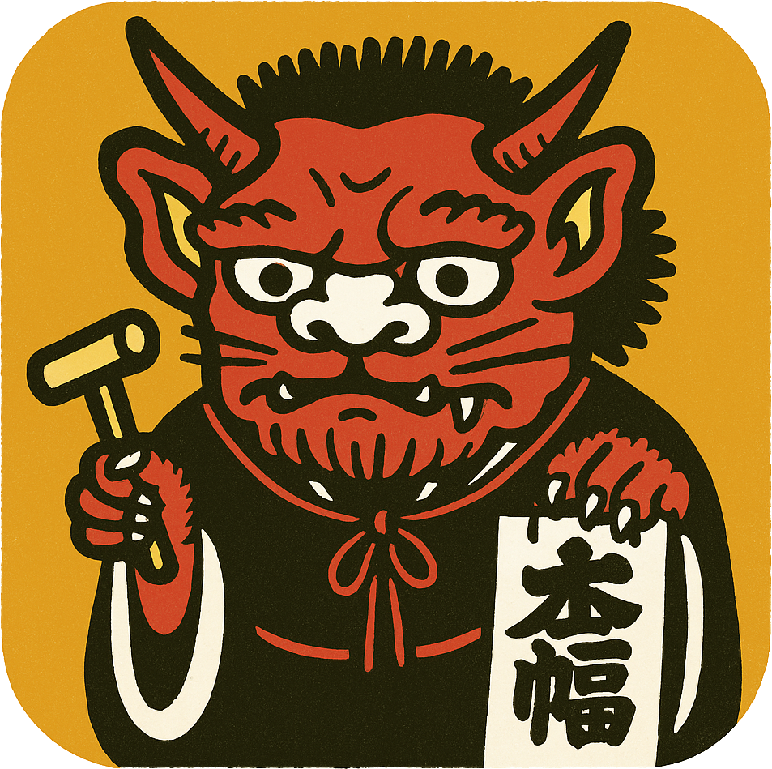

  

	<strong>Take control over your content and stream it yourself with Nostr support.</strong>

 

	

 

## About Oni

Oni is a fork of [Owncast](https://owncast.online) with support for Nostr. Oni extends Owncast's self-hosted live streaming capabilities by integrating with the Nostr protocol, enabling decentralized authentication, live event broadcasting, and Lightning payments.

## Supported Nostr Features

The following Nostr event types and features are currently supported (or in progress):

- **Nostr Login**
  - Admin Controls
  - Viewer Login
- **[NIP-53](https://github.com/vitorpamplona/nips/blob/master/53.md)** - Live Event Broadcasting
- **[NIP-47](https://github.com/vitorpamplona/nips/blob/master/47.md)** - Nostr Wallet Connect
- **[NIP-57](https://github.com/vitorpamplona/nips/blob/master/57.md)** - Lightning Zaps

## Getting Started

Oni is based on Owncast, so most of the [Owncast documentation](https://owncast.online/docs/quickstart/) applies. Visit the [Quickstart](https://owncast.online/docs/quickstart/) to get up and running.

## Building from Source

Oni consists of two projects.

1. The Oni backend is written in Go.
1. The frontend is written in React.

### Important note about source code and the develop branch

The `develop` branch is always the most up-to-date state of development and this may not be what you always want. If you want to run the latest released stable version, check out the tag related to that release.

> Note: Currently Oni does not natively support Windows servers. However, Windows Users can use Windows Subsystem for Linux (WSL2) to install Oni.

### Backend

The Oni backend is a service written in Go.

1. Ensure you have prerequisites installed.
   - C compiler, such as [GCC compiler](https://gcc.gnu.org/install/download.html) or a [Musl-compatible compiler](https://musl.libc.org/)
   - [ffmpeg](https://ffmpeg.org/download.html)
1. Install the [Go toolchain](https://golang.org/dl/) (1.24 or above).
1. Clone the repo. `git clone https://github.com/TekkadanPlays/oni.git`
1. `go run main.go` will run from the source.
1. Visit `http://yourserver:8080` to access the web interface or `http://yourserver:8080/admin` to access the admin.
1. Point your [broadcasting software](https://owncast.online/docs/broadcasting/) at your new server and start streaming.

### Frontend

The frontend is the web interface that includes the player, chat, embed components, and other UI.

1. This project lives in the `web` directory.
1. Run `npm install` to install the Javascript dependencies.
1. Run `npm run dev`

## Contributing

Oni is a fork of Owncast that adds Nostr integration capabilities. Contributions are welcome!

We abide by our [Code of Conduct](CODE_OF_CONDUCT.md) and feel strongly about open, appreciative, and empathetic people joining us.

## License

Distributed under the MIT License. See `LICENSE` for more information.

## Acknowledgments

Oni is a fork of [Owncast](https://github.com/owncast/owncast), an excellent open source live streaming platform. Thank you to the Owncast team and community for their work.
